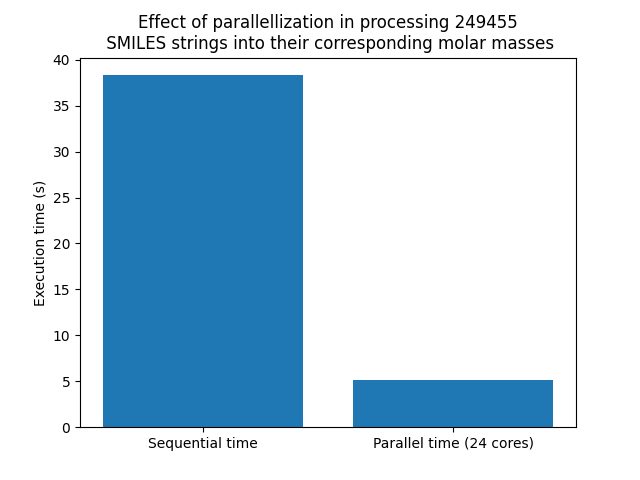

# High-Throughput SMILES Parsing: Multiprocessing PoC

This repository demonstrates the application of Python's `multiprocessing` architecture to accelerate a heavily CPU-bound cheminformatics workflow.

## The Objective Bottleneck
Parsing text-based SMILES data into mathematical graph representations using RDKit (`Chem.MolFromSmiles`) is  compute-intensive. When processing large chemical libraries, single-threaded execution becomes a severe bottleneck. 

This script isolates the RDKit processing logic and distributes it across a local CPU worker pool to benchmark the scaling efficiency against a sequential baseline.

## Hardware & Execution Environment
* Dataset: 249,455 clean SMILES strings (Derived from ZINC)
* Compute: Executed on a 24-core environment

## Installation & Usage

Navigate to the project directory:

`cd path/to/smiles`

Create and activate the isolated environment:


`conda create -n smiles_scaling python=3.10`

`conda activate smiles_scaling`

Install the required dependencies (pandas, rdkit, matplotlib):

`pip install -r requirements.txt`

Execute benchmark:

`python scaling.py`

## Benchmark Results & Scaling Efficiency

The script outputs the raw execution times and generates a comparative bar chart (`Figure_1.png`).

Example Output:

```
Loading data...
Successfully loaded 249,455 molecules

Starting parallel run (24 cores)...
Parallel run concluded in 4.2 seconds

Starting sequential run (1 core)...
Sequential run concluded in 39.4 seconds
```



## Analysis

The parallelized run achieved an ~8.0x speedup (39.4s vs 4.2s) over the sequential baseline.

While executed on 24 cores, the scaling does not reach a perfect 24x linear speedup. This is expected behavior for local Python multiprocessing, as the Inter-Process Communication (IPC) overhead, specifically the serialization (pickling) of the string data from the main process to the worker nodes and the deserialization of the resulting floats, creates a secondary bottleneck.